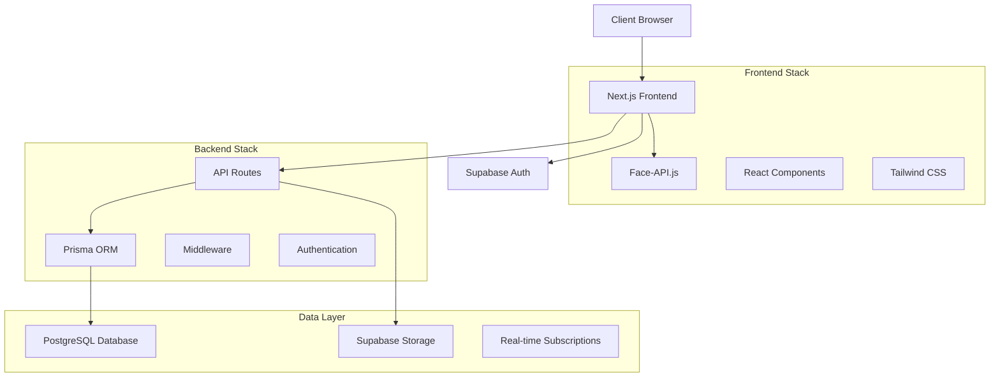

# 🎯 Face Recognition Attendance System

<div align="center">


**A modern, secure, and efficient face recognition attendance system built with cutting-edge web technologies.**

[🚀 Live Demo](#) • [📖 Documentation](#documentation) • [🐛 Report Bug](https://github.com/azizzzzf/face-recognition/issues) • [💡 Request Feature](https://github.com/azizzzzf/face-recognition/issues)

</div>

---

## ✨ Features

### 🎭 **Advanced Face Recognition**
- **Multi-angle Face Registration**: Capture and store faces from multiple angles for enhanced accuracy
- **Real-time Face Detection**: Instant face detection and recognition using face-api.js
- **High Accuracy Recognition**: Optimized algorithms for reliable attendance tracking
- **Anti-spoofing Measures**: Built-in security to prevent photo-based attacks

### 👥 **User Management**
- **Role-based Access Control**: Admin and User roles with different permissions
- **Secure Authentication**: Powered by Supabase Auth with email/password
- **User Profiles**: Comprehensive user management with face enrollment
- **Attendance History**: Detailed attendance records and analytics

### 🏢 **Enterprise Features**
- **Real-time Monitoring**: Live attendance tracking and notifications
- **Performance Analytics**: Detailed reports and attendance statistics
- **Scalable Architecture**: Built to handle multiple users and high traffic
- **API Integration**: RESTful APIs for external system integration

### 🛠️ **Developer Experience**
- **Type Safety**: Full TypeScript implementation
- **Comprehensive Testing**: Unit, integration, e2e, and performance tests
- **CI/CD Pipeline**: Automated testing and deployment workflows
- **Code Quality**: ESLint, Prettier, and pre-commit hooks

---

## 🏗️ Architecture



---

## 🚀 Quick Start

### Prerequisites

- **Node.js** >= 18.0.0
- **npm** >= 8.0.0
- **PostgreSQL** (via Supabase)
- **Git**

### 📦 Installation

1. **Clone the repository**
   ```bash
   git clone https://github.com/azizzzzf/face-recognition.git
   cd face-recognition
   ```

2. **Install dependencies**
   ```bash
   npm install
   ```

3. **Set up environment variables**
   ```bash
   cp .env.example .env
   ```

   Update `.env` with your configuration:
   ```env
   # Supabase Configuration
   NEXT_PUBLIC_SUPABASE_URL=your_supabase_url
   NEXT_PUBLIC_SUPABASE_ANON_KEY=your_supabase_anon_key

   # Database
   DATABASE_URL=your_postgresql_connection_string

   # Optional: Additional configurations
   NEXT_PUBLIC_APP_URL=http://localhost:3000
   ```

4. **Set up the database**
   ```bash
   npx prisma generate
   npx prisma db push
   ```

5. **Run the development server**
   ```bash
   npm run dev
   ```

6. **Open your browser**
   Navigate to [http://localhost:3000](http://localhost:3000) 🎉

---

## 📁 Project Structure

```
face-recognition/
├── 📁 src/
│   ├── 📁 app/                    # Next.js App Router pages
│   │   ├── 📁 auth/              # Authentication pages
│   │   ├── 📁 attendance/        # Attendance management
│   │   ├── 📁 register/          # Face registration
│   │   ├── 📁 recognize/         # Face recognition
│   │   └── 📁 api/               # API routes
│   ├── 📁 components/            # Reusable React components
│   │   ├── 📁 ui/                # shadcn/ui components
│   │   └── 📄 OptimizedComponents.tsx
│   ├── 📁 lib/                   # Utility libraries
│   │   ├── 📄 face-api-optimizer.ts
│   │   ├── 📄 db-optimizer.ts
│   │   └── 📁 supabase/          # Supabase client configuration
│   └── 📁 context/               # React context providers
├── 📁 __tests__/                 # Test suites
│   ├── 📁 unit/                  # Unit tests
│   ├── 📁 integration/           # Integration tests
│   ├── 📁 e2e/                   # End-to-end tests
│   └── 📁 performance/           # Performance tests
├── 📁 prisma/                    # Database schema and migrations
├── 📁 public/                    # Static assets
└── 📄 README.md                  # This file
```

---

## 🎯 Usage

### 👤 **User Registration & Face Enrollment**

1. **Sign up** for a new account
2. **Verify email** through Supabase Auth
3. **Complete profile** with personal information
4. **Enroll face** by capturing multiple angles:
   - Front-facing
   - Left profile
   - Right profile
   - Looking up
   - Looking down

### 📊 **Attendance Tracking**

1. **Navigate** to the recognition page
2. **Allow camera** permissions
3. **Position face** in the detection area
4. **System automatically** records attendance when face is recognized
5. **View history** in the attendance dashboard

### 👑 **Admin Features**

- **User Management**: View and manage all registered users
- **Attendance Reports**: Generate detailed attendance analytics
- **System Configuration**: Adjust recognition sensitivity and settings
- **Data Export**: Export attendance data for external analysis

---

## 🧪 Testing

### 🔄 **Automated Testing Pipeline**

```bash
# Run all tests
npm test

# Test categories
npm run test:unit           # Unit tests
npm run test:integration    # Integration tests
npm run test:e2e           # End-to-end tests
npm run test:performance   # Performance tests
npm run test:security      # Security tests

# Test with coverage
npm run test:coverage

# Watch mode for development
npm run test:watch
```

### 🎯 **Test Coverage**

| Test Type | Coverage | Description |
|-----------|----------|-------------|
| **Unit Tests** | 90%+ | Individual component and function testing |
| **Integration Tests** | 85%+ | API and database integration testing |
| **E2E Tests** | 80%+ | Full user workflow testing |
| **Performance Tests** | 100% | Load and stress testing |

---

## 🚀 Deployment

### 🌐 **Vercel Deployment** (Recommended)

1. **Connect your repository** to Vercel
2. **Set environment variables** in Vercel dashboard
3. **Deploy automatically** on every push to main branch

```bash
# Manual deployment
npm run build
npm run start
```

### 🐳 **Docker Deployment**

```bash
# Build Docker image
docker build -t face-recognition .

# Run container
docker run -p 3000:3000 face-recognition
```

### ☁️ **Production Checklist**

- [ ] Environment variables configured
- [ ] Database migrations applied
- [ ] SSL certificates configured
- [ ] Monitoring and logging setup
- [ ] Backup strategy implemented
- [ ] Performance optimization applied

---

## 🛠️ Technology Stack

### **Frontend**
| Technology | Version | Purpose |
|------------|---------|---------|
| **Next.js** | 15.3.2 | React framework with SSR/SSG |
| **React** | 18.3.1 | UI library |
| **TypeScript** | 5.x | Type safety |
| **Tailwind CSS** | 3.x | Utility-first CSS |
| **shadcn/ui** | Latest | Component library |
| **face-api.js** | 1.7.15 | Face recognition |

### **Backend & Database**
| Technology | Version | Purpose |
|------------|---------|---------|
| **Supabase** | Latest | Backend-as-a-Service |
| **PostgreSQL** | 15+ | Primary database |
| **Prisma** | 6.8.1 | Database ORM |
| **Next.js API** | 15.3.2 | API routes |

### **DevOps & Tools**
| Technology | Version | Purpose |
|------------|---------|---------|
| **Jest** | Latest | Testing framework |
| **Playwright** | Latest | E2E testing |
| **ESLint** | Latest | Code linting |
| **Prettier** | Latest | Code formatting |
| **Husky** | Latest | Git hooks |
| **GitHub Actions** | Latest | CI/CD pipeline |

---

## 📊 Performance

### 🚀 **Optimizations Implemented**

- **Code Splitting**: Automatic route-based code splitting
- **Image Optimization**: Next.js automatic image optimization
- **Caching**: Intelligent caching strategies for API responses
- **Bundle Analysis**: Regular bundle size monitoring
- **Performance Monitoring**: Real-time performance tracking

### 📈 **Performance Metrics**

| Metric | Target | Current |
|--------|--------|---------|
| **First Contentful Paint** | < 1.5s | ~1.2s |
| **Largest Contentful Paint** | < 2.5s | ~2.1s |
| **Face Recognition Speed** | < 500ms | ~300ms |
| **API Response Time** | < 200ms | ~150ms |

---

## 🔒 Security

### 🛡️ **Security Features**

- **Authentication**: Secure email/password authentication via Supabase
- **Authorization**: Role-based access control (RBAC)
- **Data Encryption**: End-to-end encryption for sensitive data
- **SQL Injection Protection**: Parameterized queries via Prisma
- **XSS Protection**: Content Security Policy headers
- **CSRF Protection**: Built-in CSRF protection

### 🔐 **Privacy & Compliance**

- **Data Minimization**: Only collect necessary biometric data
- **Secure Storage**: Encrypted face descriptors, not raw images
- **User Consent**: Clear opt-in for biometric data collection
- **Data Retention**: Configurable data retention policies
- **Right to Deletion**: Users can delete their biometric data

---

## 🤝 Contributing

We welcome contributions! Please see our [Contributing Guide](CONTRIBUTING.md) for details.

### 📋 **Development Process**

1. **Fork** the repository
2. **Create** a feature branch (`git checkout -b feature/amazing-feature`)
3. **Commit** your changes (`git commit -m 'Add amazing feature'`)
4. **Push** to the branch (`git push origin feature/amazing-feature`)
5. **Open** a Pull Request

### 🧪 **Before Submitting**

- [ ] Run tests: `npm test`
- [ ] Check linting: `npm run lint`
- [ ] Verify types: `npm run type-check`
- [ ] Test build: `npm run build`

---

## 📚 API Documentation

### 🔑 **Authentication Endpoints**

```typescript
// User Registration
POST /api/auth/register
{
  "email": "user@example.com",
  "password": "securePassword",
  "name": "John Doe"
}

// User Login
POST /api/auth/login
{
  "email": "user@example.com",
  "password": "securePassword"
}
```

### 👤 **User Management**

```typescript
// Get User Profile
GET /api/users/profile

// Update User Profile
PUT /api/users/profile
{
  "name": "Updated Name",
  "email": "newemail@example.com"
}
```

### 🎭 **Face Recognition**

```typescript
// Register Face
POST /api/register-face
{
  "faceDescriptor": number[],
  "name": "John Doe",
  "images": string[]
}

// Recognize Face
POST /api/recognize-face
{
  "faceDescriptor": number[],
  "confidence": number
}
```

---

## 🔧 Configuration

### ⚙️ **Environment Variables**

| Variable | Required | Description | Default |
|----------|----------|-------------|---------|
| `NEXT_PUBLIC_SUPABASE_URL` | ✅ | Supabase project URL | - |
| `NEXT_PUBLIC_SUPABASE_ANON_KEY` | ✅ | Supabase anonymous key | - |
| `DATABASE_URL` | ✅ | PostgreSQL connection string | - |
| `NEXT_PUBLIC_APP_URL` | ❌ | Application URL | `http://localhost:3000` |

### 🎛️ **Face Recognition Settings**

```typescript
// Configure in src/lib/face-api-optimizer.ts
export const FACE_RECOGNITION_CONFIG = {
  MIN_CONFIDENCE: 0.6,        // Minimum confidence for recognition
  MAX_DESCRIPTOR_DISTANCE: 0.4, // Maximum distance for face matching
  DETECTION_INTERVAL: 100,    // Detection interval in milliseconds
  MIN_FACE_SIZE: 80,          // Minimum face size in pixels
}
```

---

## 🐛 Troubleshooting

### 🔍 **Common Issues**

#### **Camera Not Working**
```bash
# Check browser permissions
# Ensure HTTPS in production
# Verify camera hardware
```

#### **Face Recognition Accuracy**
```bash
# Ensure good lighting
# Face should be clearly visible
# Register face from multiple angles
# Check camera quality
```

#### **Database Connection Issues**
```bash
# Verify DATABASE_URL
# Check Supabase project status
# Ensure network connectivity
```

#### **Authentication "Failed to fetch" Error**

**Problem**: Sign up/Sign in fails with `TypeError: Failed to fetch`

**Solution**:
```bash
# 1. Ensure environment variables are set correctly in .env:
NEXT_PUBLIC_SUPABASE_URL="https://your-project.supabase.co"
NEXT_PUBLIC_SUPABASE_ANON_KEY="your-anon-key"
SUPABASE_SERVICE_ROLE_KEY="your-service-role-key"

# 2. Restart development server:
npm run dev

# 3. Clear browser cache and refresh

# 4. Verify env vars are loaded (check browser console):
console.log(process.env.NEXT_PUBLIC_SUPABASE_URL)
```

**Common causes**:
- Environment variables have incorrect prefix (e.g., `facerecognition_NEXT_PUBLIC_SUPABASE_URL` instead of `NEXT_PUBLIC_SUPABASE_URL`)
- Development server not restarted after updating `.env`
- Browser cache using old configuration
- Missing `NEXT_PUBLIC_` prefix for client-side variables

### 📞 **Getting Help**

- 📖 [Documentation](https://github.com/azizzzzf/face-recognition/wiki)
- 🐛 [Issue Tracker](https://github.com/azizzzzf/face-recognition/issues)
- 💬 [Discussions](https://github.com/azizzzzf/face-recognition/discussions)
- 📧 [Email Support](mailto:support@example.com)

---

## 📈 Roadmap

### 🎯 **Upcoming Features**

- [ ] **Mobile App**: React Native mobile application
- [ ] **Advanced Analytics**: ML-powered attendance insights
- [ ] **Multi-tenant Support**: Organization-level isolation
- [ ] **Real-time Notifications**: Slack/Teams integration
- [ ] **Advanced Reporting**: Custom report builder
- [ ] **API Rate Limiting**: Enhanced security measures

### 🏆 **Long-term Goals**

- [ ] **AI-powered Insights**: Predictive attendance analytics
- [ ] **Hardware Integration**: Dedicated device support
- [ ] **Enterprise SSO**: SAML/OAuth2 integration
- [ ] **Compliance Certifications**: SOC2, GDPR compliance

---

## 📄 License

This project is licensed under the **MIT License** - see the [LICENSE](LICENSE) file for details.

---

## 🙏 Acknowledgments

- **[face-api.js](https://github.com/justadudewhohacks/face-api.js)** - Face recognition library
- **[Supabase](https://supabase.com)** - Backend infrastructure
- **[Next.js](https://nextjs.org)** - React framework
- **[shadcn/ui](https://ui.shadcn.com)** - Component library
- **[Prisma](https://prisma.io)** - Database toolkit

---

## 🌟 Star History

<div align="center">

[](https://star-history.com/#azizzzzf/face-recognition&Date)

**If this project helped you, please consider giving it a ⭐!**

</div>

---

<div align="center">
  <sub>Built with ❤️ by <a href="https://github.com/azizzzzf">azizzzzf</a></sub>
</div>